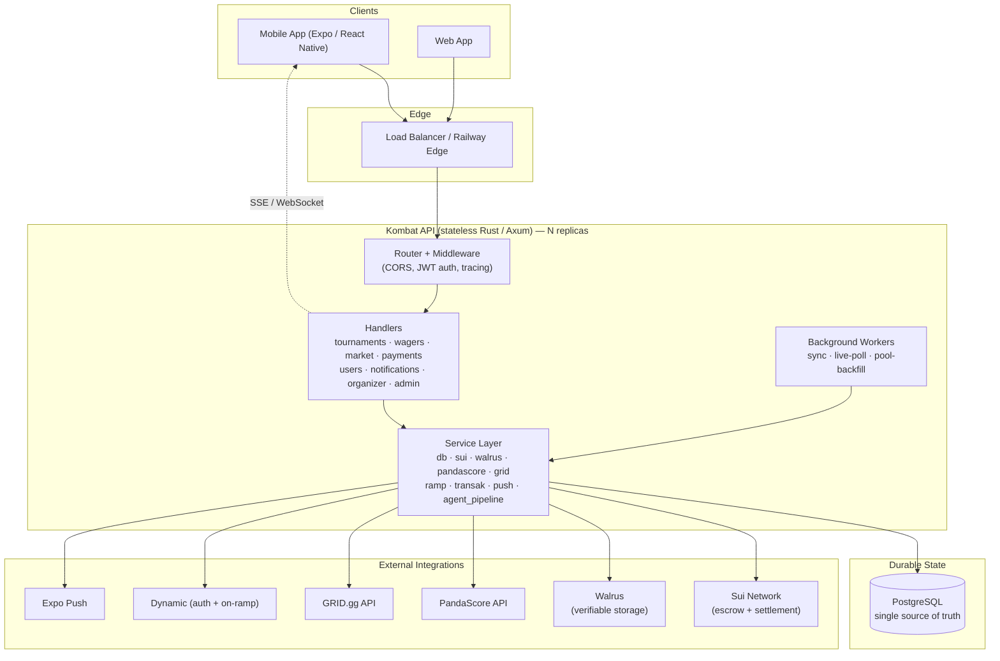
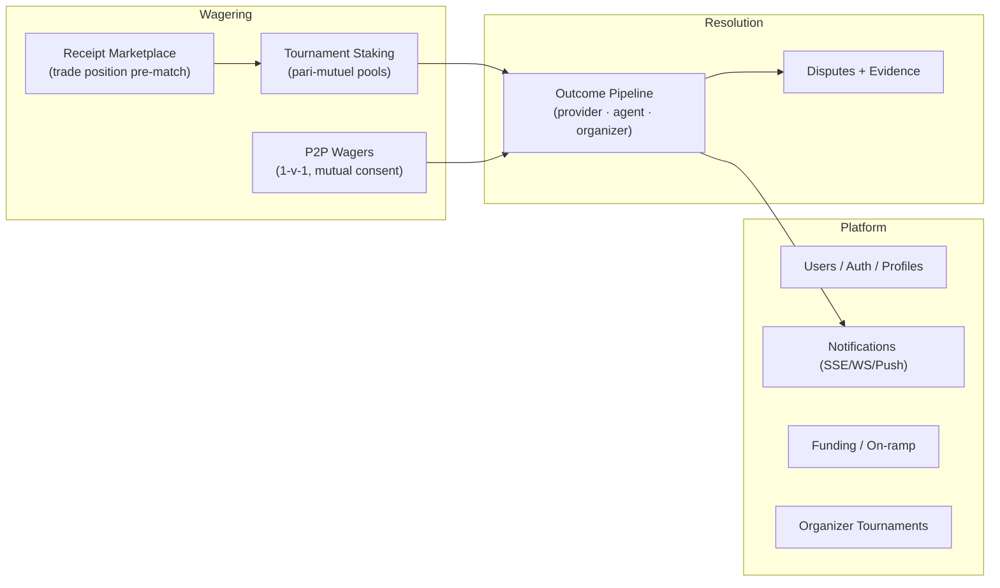
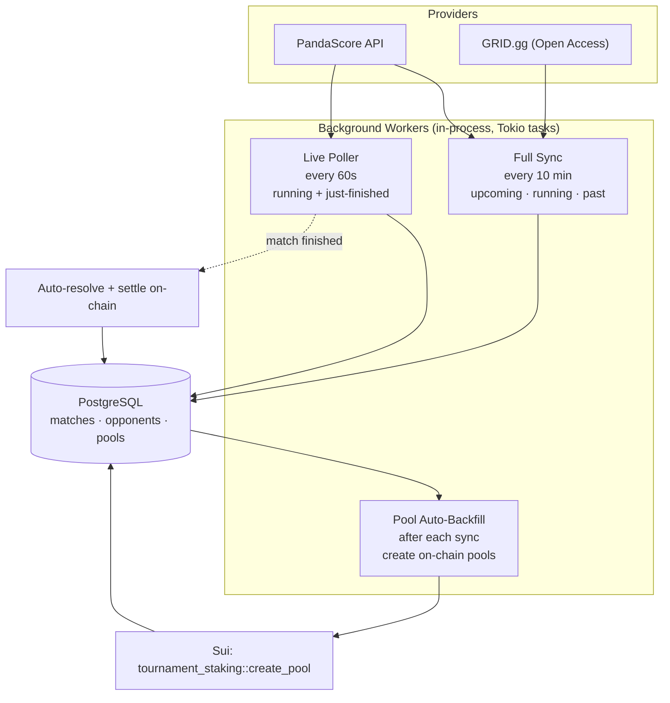
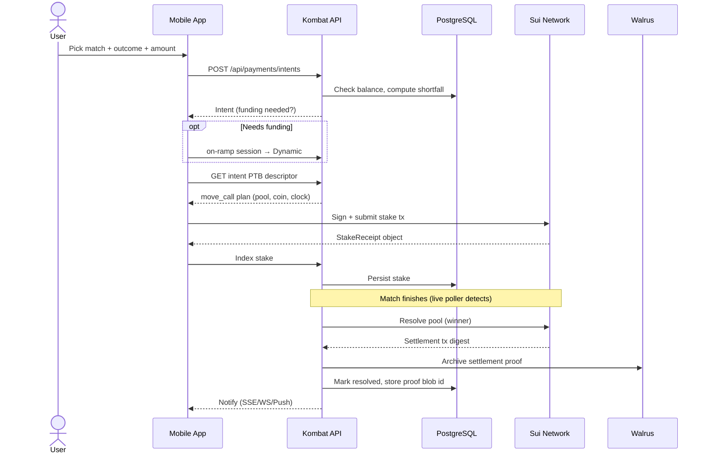
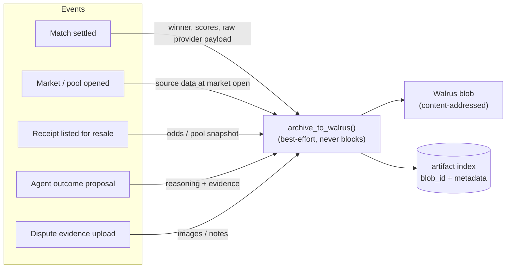
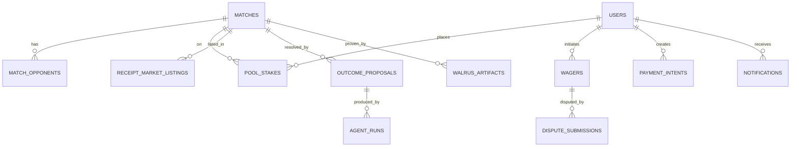
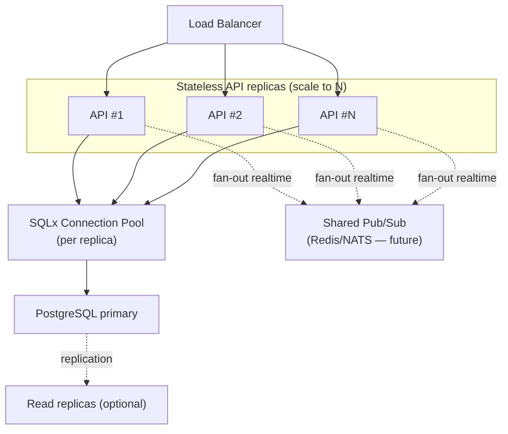

# Kombat Backend

Kombat is a **Sui-first esports wagering platform**. Users stake real value on live and
upcoming professional esports matches; every wager is escrowed and settled by on-chain
smart contracts, and every settlement is archived to decentralized storage so results are
independently verifiable.

This repository is the backend API: a single, stateless [Rust](https://www.rust-lang.org/)
service built on [Axum](https://github.com/tokio-rs/axum) that orchestrates match data
ingestion, on-chain settlement, a receipt marketplace, peer-to-peer wagers, and a verifiable
outcome pipeline.

- **Production:** `https://kombat-backend-production.up.railway.app`
- **Local:** `http://localhost:3000`
- **Frontend integration guide:** [`docs/frontend-integration-guide.md`](docs/frontend-integration-guide.md)
- **Mobile API reference:** [`docs/MOBILE_API_REFERENCE.md`](docs/MOBILE_API_REFERENCE.md)

---

## Table of Contents

1. [Tech Stack](#tech-stack)
2. [System Architecture](#system-architecture)
3. [Core Domains](#core-domains)
4. [Match Data Pipeline](#match-data-pipeline)
5. [Staking & Settlement Flow](#staking--settlement-flow)
6. [Verifiability with Walrus](#verifiability-with-walrus)
7. [Data Model](#data-model)
8. [Scalability](#scalability)
9. [Background Workers](#background-workers)
10. [Project Structure](#project-structure)
11. [Configuration](#configuration)
12. [Running Locally](#running-locally)
13. [Observability](#observability)
14. [Deployment](#deployment)

---

## Tech Stack

| Layer | Choice | Why |
|-------|--------|-----|
| Language | **Rust** (2021) | Memory safety + predictable performance under high concurrency |
| HTTP | **Axum 0.7** + Tokio | Async, non-blocking; thousands of concurrent connections per instance |
| Database | **PostgreSQL** via **SQLx 0.8** | Compile-time-checked queries, connection pooling, single source of truth |
| Money math | **rust_decimal** | Exact integer micro-USDC arithmetic (no float drift) |
| Blockchain | **Sui** (JSON-RPC + ed25519 signing) | On-chain escrow & settlement, USDC payouts |
| Durable storage | **Walrus** | Tamper-proof settlement proofs, evidence, provenance |
| Match data | **PandaScore** + **GRID.gg** | Real-time pro esports fixtures across 15+ titles |
| Auth | **Dynamic** embedded wallets + **JWT** (HS256) | Wallet-bound sessions |
| On-ramp | **Dynamic Native** / **Transak** | Fiat → USDC funding |
| Realtime | **SSE** + **WebSocket** (Tokio broadcast) | Live notifications |
| Push | **Expo** | Mobile notifications |
| Metrics | **Prometheus** | `/metrics` scrape endpoint |

---

## System Architecture

The backend is a **stateless API layer** in front of a single Postgres database, fronting a
set of external integrations. No request-scoped state lives in the process — all durable
state is in Postgres or on-chain — which is what makes the API horizontally scalable.



**Key properties**

- **Stateless request path** — any replica can serve any request; sessions are JWTs, not
  server memory.
- **Database as the cache** — match data is ingested on a schedule and read from Postgres,
  so user traffic never hits (or is rate-limited by) external providers.
- **Provider isolation** — a slow or failing external API degrades one background job, not
  the user-facing read path.
- **On-chain work is offloaded** — expensive Sui transactions (pool creation, settlement)
  run in background workers, never blocking an HTTP request.

---

## Core Domains



| Domain | Description |
|--------|-------------|
| **Tournament staking** | Pari-mutuel pools per match. Stake USDC on an outcome; on-chain pool settles winners automatically. |
| **P2P wagers** | Head-to-head bets with mutual-consent (or arbitrator) resolution and a dispute path. |
| **Receipt marketplace** | A stake is a tradable `StakeReceipt` object — list and sell your position before a match ends. |
| **Outcome pipeline** | Resolves results from providers, autonomous agents, or organizers, gated by confidence + cross-checks. |
| **Funding** | Fiat→USDC via Dynamic Native on-ramp (Transak fallback). |
| **Organizer tournaments** | Community organizers host their own matches with durable rules/brackets. |

---

## Match Data Pipeline

Match data is **ingested in the background and served from Postgres** — never fetched from
providers on the user's request path. Three cooperating loops keep the lobby fresh and
self-healing:



| Loop | Cadence | Job |
|------|---------|-----|
| **Full sync** | 10 min | Pull upcoming/running/past, upsert matches & opponents, advance stale statuses |
| **Live poller** | 60 s | Refresh live + just-finished matches (≈2 API calls/cycle) for near-real-time status/score |
| **Pool auto-backfill** | per sync | Create an on-chain Sui pool for every complete match so it becomes stakeable, hands-off |

A **realtime webhook** endpoint (`POST /api/webhooks/pandascore`) is also wired for instant
push updates where the provider plan supports it; the poller is the no-webhook fallback so
freshness never depends on a single mechanism.

> Staleness guard: matches still marked `upcoming` whose start time has passed are filtered
> out of the lobby query, so never-updated rows can't leak into the feed.

---

## Staking & Settlement Flow

The backend returns **PTB (Programmable Transaction Block) descriptors** — the user's wallet
signs and submits; the backend never holds private keys for user funds.



---

## Verifiability with Walrus

Every value-bearing event writes an **immutable manifest to Walrus** (decentralized storage
on Sui), with the blob id indexed in Postgres. Because the manifest is content-addressed and
durable, neither Kombat nor anyone else can alter a result after the fact.



Archival is **best-effort by design**: if Walrus is unavailable, the primary operation
(settlement, listing, upload) still succeeds — durability is added value, never a blocker.
Epoch retention scales with pool size, so high-stakes evidence is pinned longer.

---

## Data Model

PostgreSQL is the single source of truth. Schema is managed by ordered SQL migrations in
[`migrations/`](migrations/) (applied on boot).



Notable tables: `matches`, `match_opponents`, `pool_stakes`, `wagers`,
`receipt_market_listings`, `payment_intents`, `outcome_proposals`, `agent_runs`,
`walrus_artifacts`, `dispute_submissions`, `notifications`, `idempotency_keys`.

---

## Scalability

The system is designed to **scale horizontally on the read/write path** and **isolate slow
work** off it.



**What makes it scale**

1. **Stateless API** — no sticky sessions; add replicas behind the load balancer linearly.
   JWTs carry identity, so any replica serves any user.
2. **Async, non-blocking I/O** — Tokio + Axum handle thousands of concurrent connections per
   replica; DB and network calls never block a thread.
3. **Database-backed reads** — the lobby and most reads hit Postgres, not external providers,
   so user traffic is decoupled from third-party rate limits and latency.
4. **Connection pooling** — SQLx pools cap and reuse DB connections per replica.
5. **Background offload** — on-chain transactions, provider sync, and pool creation run in
   capped background tasks (e.g. ≤25 pool creations/cycle) so spikes never stall HTTP.
6. **Idempotency keys** — safe client retries without double-spend or duplicate writes.
7. **Exact-integer money math** — micro-USDC integers avoid floating-point drift at any volume.

**Scaling roadmap (honest current limits → next steps)**

| Concern | Today | Next step at higher scale |
|---------|-------|---------------------------|
| Realtime fan-out | In-process Tokio broadcast (per replica) | Shared **Redis/NATS** pub-sub so SSE/WS works across replicas |
| Background workers | Run in every replica | Elect a **single leader** (or move to a dedicated worker service / cron) to avoid duplicated sync |
| Reads | Single Postgres primary | Add **read replicas**; route reads via pool |
| On-chain throughput | One platform signer | **Multiple gas objects / signer rotation** to parallelize pool creation |
| Hot endpoints | Direct DB | Add a **cache layer** (Redis) for the lobby + odds |

> The architecture already separates these concerns cleanly, so each step above is an
> additive change, not a rewrite.

---

## Background Workers

Spawned at boot (see `spawn_pandascore_scheduler` / `spawn_pandascore_live_poller` in
`app/src/main.rs`):

- **PandaScore full sync** — `PANDASCORE_SYNC_INTERVAL_MINUTES` (default 10)
- **Live poller** — `PANDASCORE_LIVE_POLL_SECONDS` (default 60)
- **Pool auto-backfill** — `POOL_AUTO_BACKFILL` (default on when signer configured), capped by
  `POOL_AUTO_BACKFILL_LIMIT` (default 25/cycle)

All are env-gated and degrade safely: a failed cycle logs a warning and retries next tick.

---

## Project Structure

```
app/
├── src/
│   ├── main.rs            # Router, middleware, worker spawn, server bootstrap
│   ├── state.rs           # AppState: Arc-shared services
│   ├── models.rs          # Request/response + DB record types
│   ├── handlers/          # HTTP handlers per domain
│   │   ├── tournament.rs  # staking, sync, pool backfill, resolution
│   │   ├── wager.rs       # P2P wagers + disputes
│   │   ├── market.rs      # receipt marketplace
│   │   ├── payment.rs     # payment intents (smart-pay)
│   │   ├── sui.rs         # wallet dashboards, balances, PTB descriptors
│   │   ├── walrus.rs      # artifact API
│   │   ├── webhook.rs     # provider + result webhooks
│   │   ├── user.rs · notifications.rs · organizer.rs · admin.rs · ...
│   └── services/          # Integration + domain logic
│       ├── db.rs          # all SQL (SQLx)
│       ├── sui.rs · sui_tx.rs   # Sui RPC + ed25519 signing
│       ├── walrus.rs      # durable storage client
│       ├── pandascore.rs · grid.rs   # match data providers
│       ├── agent_pipeline.rs  # outcome verification + Walrus archival
│       ├── ramp.rs · transak.rs · push.rs · dynamic.rs · upload.rs
├── Cargo.toml
migrations/                # ordered SQL migrations (applied on boot)
docs/                      # FE integration + mobile API references
```

---

## Configuration

Configuration is entirely environment-driven (`.env` locally, platform vars in production).
Key groups:

```bash
# Core
DATABASE_URL=postgres://...
PORT=3000
AUTH_JWT_SECRET=...
AUTH_ADMIN_TOKEN=...

# Sui (testnet shown)
SUI_NETWORK=testnet
PLATFORM_SIGNER_KEYPAIR=[64-byte JSON array]      # owns the staking AdminCap
SUI_TESTNET_PACKAGE_ID=0x...
SUI_TESTNET_ADMIN_CAP_OBJECT_ID=0x...
SUI_TESTNET_USDC_COIN_TYPE=0x...::usdc::USDC

# Match data
PANDASCORE_API_KEY=...
PANDASCORE_AUTO_SYNC=true
PANDASCORE_SYNC_INTERVAL_MINUTES=10
PANDASCORE_LIVE_POLL_SECONDS=60
GRID_API_KEY=...
GRID_BASE_URL=https://api-op.grid.gg

# Pools
POOL_AUTO_BACKFILL=true
POOL_AUTO_BACKFILL_LIMIT=25
MATCH_STALE_UPCOMING_HOURS=4

# Storage / auth / push
WALRUS_ENABLED=true
WALRUS_PUBLISHER_URL=...
WALRUS_AGGREGATOR_URL=...
DYNAMIC_ENVIRONMENT_ID=...
```

> Secrets (`.env`) are git-ignored. In production, set them in the deploy platform's dashboard.

---

## Running Locally

```bash
# 1. Postgres running and DATABASE_URL set in app/.env

# 2. Build & run (migrations apply on boot)
cd app
cargo run

# 3. Health check
curl http://localhost:3000/health

# Tests
cargo test
```

---

## Observability

| Endpoint | Purpose |
|----------|---------|
| `GET /health` | Liveness + integration config status (Sui, Walrus, providers, signer address) |
| `GET /api/sui/health` | Sui RPC reachability per network |
| `GET /metrics` | Prometheus metrics |

Structured logs via `tracing` (set `RUST_LOG` / `EnvFilter`). Background workers log each
cycle's outcome (`fetched/synced/resolved`, `created/skipped/failed`).

---

## Deployment

Deployed on **Railway**; pushes to `main` trigger a build and rolling redeploy. No DB
migration step is needed beyond the ordered files in `migrations/`, which run on boot.

**Operational notes**

- Keep the platform signer wallet (the address shown at `/health`) funded with gas — it pays
  for pool creation and settlement.
- The signer must **own the staking AdminCap**; don't overwrite `PLATFORM_SIGNER_KEYPAIR` with
  a key that doesn't.
- Watch worker logs for `auto_backfill=true` and rising `created` counts to confirm the
  import → stakeable pipeline is healthy.

---

_For client/API contract details (endpoints, payloads, auth, PTB signing), see
[`docs/frontend-integration-guide.md`](docs/frontend-integration-guide.md)._
